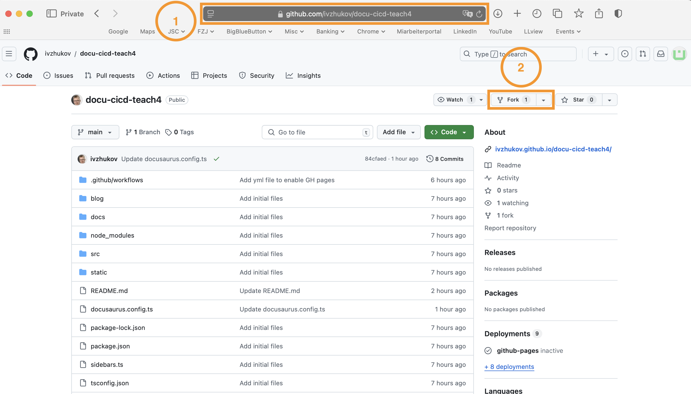
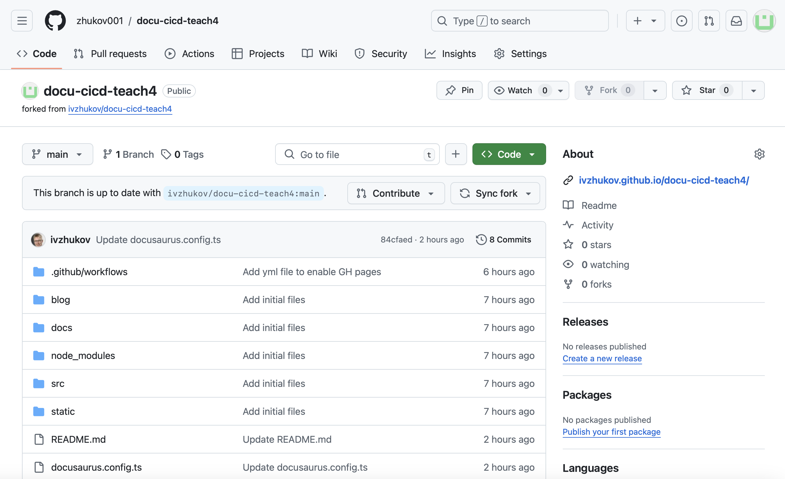
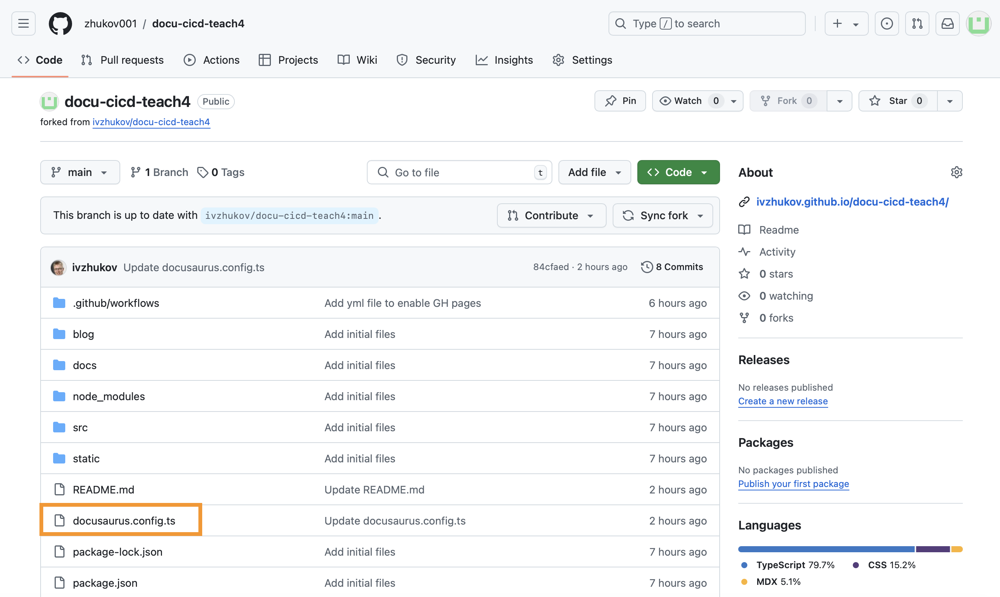
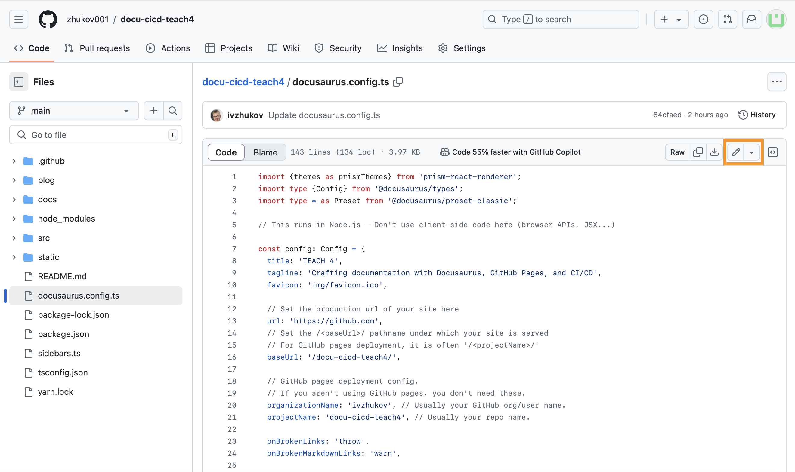
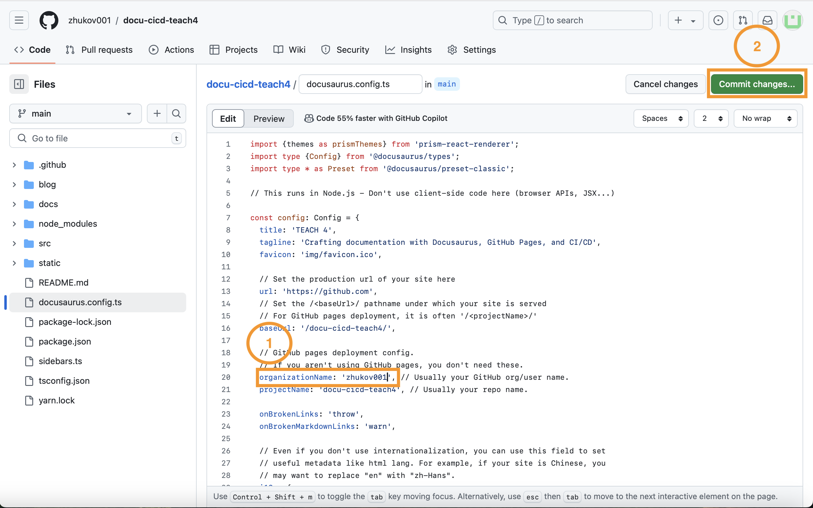
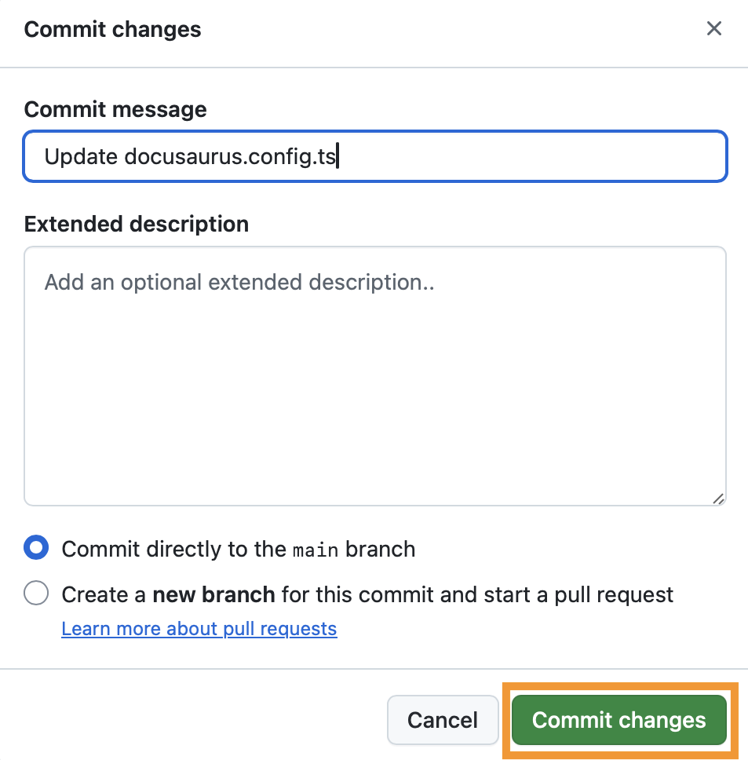
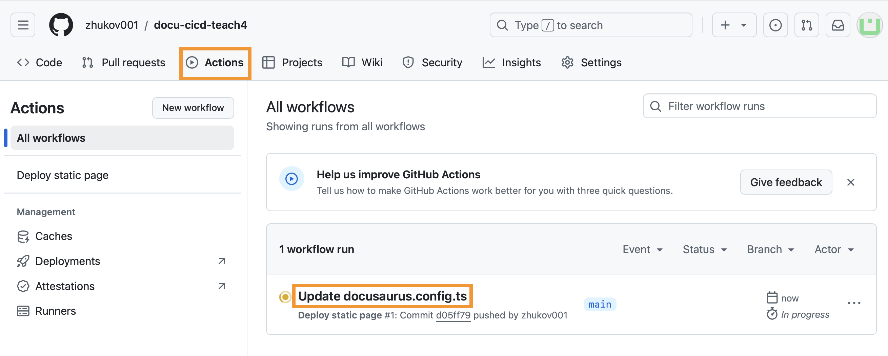
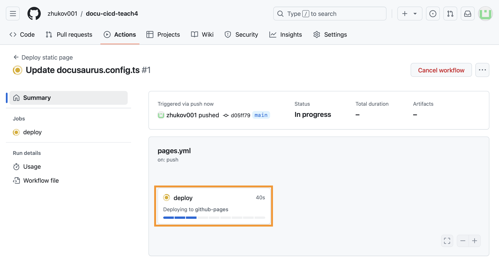
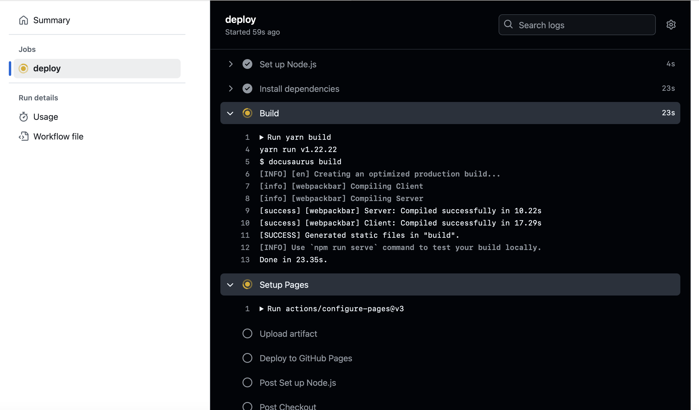

# Deploy my first website on GitHub

Login with your GitHub account and open the following repository 
```
https://github.com/ivzhukov/docu-cicd-teach4
```
then make a fork of it.

:::info
When you fork a repository on GitHub, it creates an independent copy of the original repository under your account, including all its files, branches, commits, and history. This new copy has its own remote URL, allowing you to make changes without affecting the original project. GitHub maintains a link between your fork and the original, so you can submit pull requests to suggest your changes. However, the fork remains separate, so updates in the original repository do not automatically appear in your fork, and changes in your fork do not affect the original unless merged through a pull request.
:::




After successful forking you should see in the top left corner your login name and below a line where it was forked from, e.g. like on the picture `forked from ivzhukov/docu-cicd-teach4`.

When you fork a repository, GitHub disables Actions (automated workflows like tests or deployments) by default for safety. To use them, we need to enable Actions for the forked repository as shown in the picture. Before doing this, it's a good idea to review the workflows to ensure they are safe and won't cause issues when they run.




<details>
  <summary>Open me for more details!</summary>

GitHub Actions are defined in the `.github/workflows` directory of a repository. If you open the `pages.yaml` file within that directory, you will find the full description of the workflow. This file contains the steps and configuration details for automating tasks. Each step in the file outlines specific actions to be performed, such as setting up dependencies, building the site, and deploying it.

  ```yaml
name: Deploy static page

on:
  # Runs on pushes targeting the default branch
  push:
    branches: [main]

# Sets permissions of the GITHUB_TOKEN to allow deployment to GitHub Pages
permissions:
  contents: read
  pages: write
  id-token: write

# Allow one concurrent deployment
concurrency:
  group: "pages"
  cancel-in-progress: true

jobs:
  deploy:
    environment:
      name: github-pages
      url: ${{ steps.deployment.outputs.page_url }}

    runs-on: ubuntu-latest

    steps:
      - name: Checkout
        uses: actions/checkout@v4
      # Build steps
      - name: Set up Node.js
        uses: actions/setup-node@v4
        with:
          node-version: 20.x
          cache: yarn
      - name: Install dependencies
        run: yarn install --frozen-lockfile --non-interactive
      - name: Build
        run: yarn build
      # Build steps
      - name: Setup Pages
        uses: actions/configure-pages@v5.0.0
      - name: Upload artifact
        uses: actions/upload-pages-artifact@v3.0.1
        with:
          # Specify build output path
          path: build
      - name: Deploy to GitHub Pages
        id: deployment
        uses: actions/deploy-pages@v4.0.5
  ```
The provided GitHub Actions script automates deploying a static site to GitHub Pages whenever there is a push to the `main` branch.

First, it sets permissions for the GitHub token to read the repository content and write to GitHub Pages. It uses concurrency control to ensure only one deployment runs at a time, canceling any ongoing ones if a new push is detected.

The main deployment job checks out the code, sets up `Node.js` (It allows to run JavaScript on the server. It's needed in GitHub to build and run projects that use JavaScript, like static websites or web apps.), installs dependencies using `yarn`, and builds the static site. It then configures GitHub Pages and uploads the build output from the build directory as an artifact (the files generated during the build process). Finally, the script deploys this artifact to GitHub Pages, making the site live.

This setup allows automatic building and publishing of the static site whenever updates are pushed to main.

</details>

Enable GitHub Actions (like the `pages.yaml` file).


After you’re done, go back to your repository by clicking on its name in the top left corner. Then, update the GitHub website link, because the site will now be in a new location since we forked it from a different repository. 

:::important
Remember the updated GitHub website link. Once everything is deployed, this link will point to the live, active GitHub website.
:::


Now, let's modify the `docusaurus.config.ts` file by clicking on its name in the project. To edit it, click the pencil icon in the menu.



:::important
The `docusaurus.config.ts` file is the main configuration file for a Docusaurus project, which is a tool used to build documentation websites. This file is written in TypeScript (.ts), and it defines various settings and options that control how your Docusaurus site behaves and looks.

Inside `docusaurus.config.ts`, you can configure things like:
- *Site metadata:* Set the title, description, and URL of your site.
- *Theme settings:* Customize the look and feel of your site, such as colors, fonts, and layout.
- *Navbar and footer:* Define the links and structure for your site's navigation bar and footer.
- *Plugins:* Enable extra features like search, analytics, or custom page generation.
- *Localization:* Configure multi-language support for your site.

This file is crucial for customizing the functionality and appearance of your Docusaurus site.
:::

Modify `organizationName` from `ivzhukov` to your user name, feel free to modify `title` and `tagline` as well. Once you're done with the changes click on `Commit changes` button.


Provide meaningful commit message and click on `Commit`.


:::info
A commit in Git saves changes to your project, creating a snapshot of your files. A commit message describes what changes have been made. A strong message is important because it helps others understand the purpose of the changes, making it easier to track the project's history and collaborate effectively.
:::

This commit will trigger the action defined in the `pages.yaml` file. You can watch the process and debug it if needed by going to the `Actions` tab in GitHub. From there, you can click on a specific workflow run to see the details and check if everything is working as expected.

For example here you can see that one workflow is running.


If you click on specific workflow you will additional on which step is the current workflow.


You can even see a breakdown of each step and see warnings and errors. This is very useful to identify the problem if you get stuck at one of the workflow steps.


If everything went well during our deployment, you should see a green tick. This indicates that the process has been completed successfully.


If the workflow completes without any errors, you can visit the link mentioned earlier to view the freshly generated website. It should look like this!


Congratulations! You have successfully deployed your first Docusaurus website on GitHub Pages.
